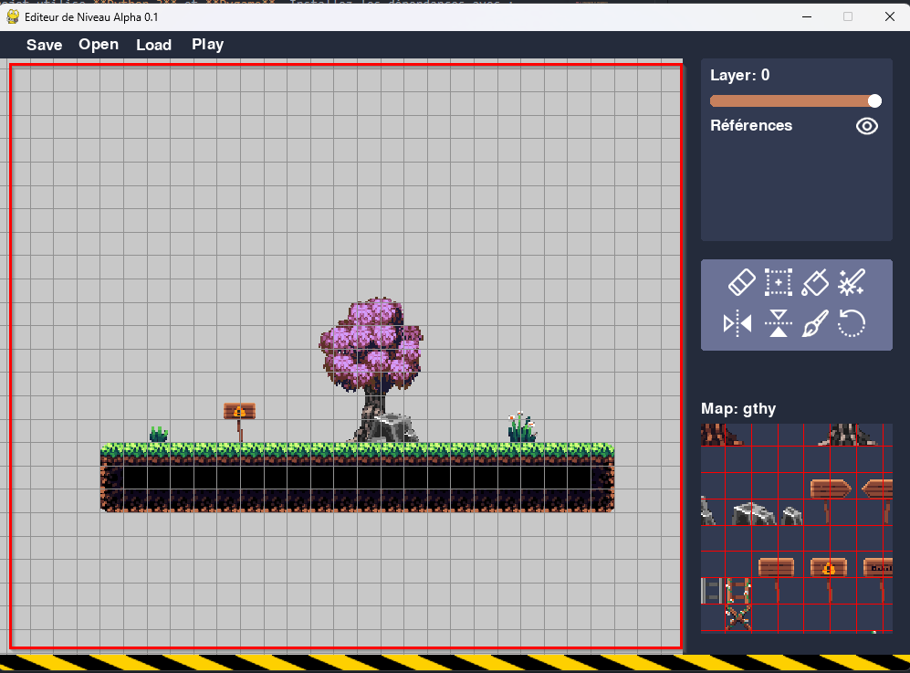
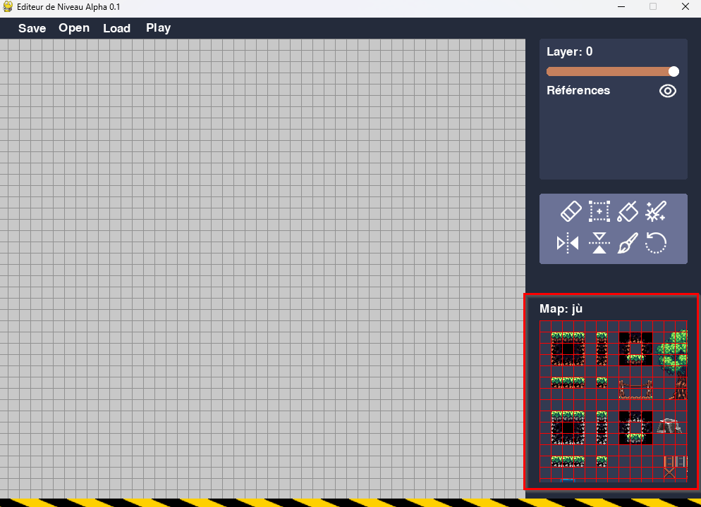
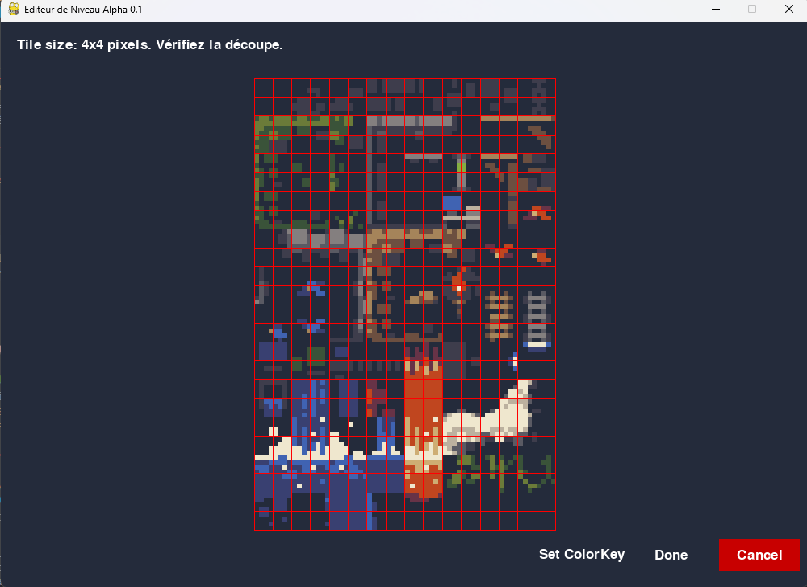
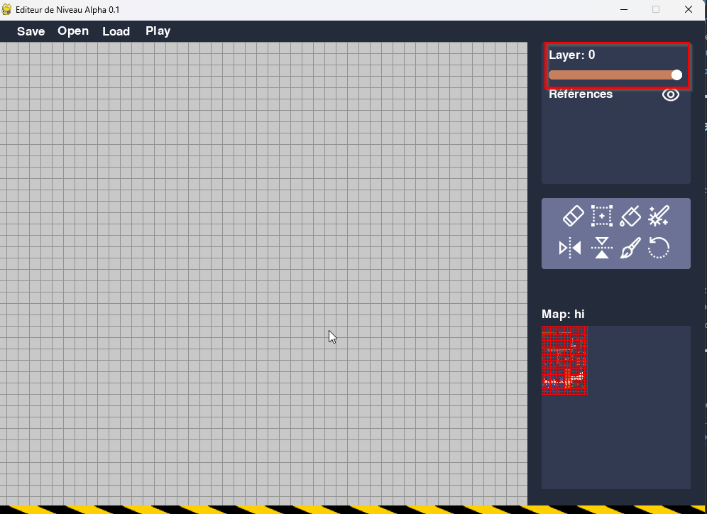
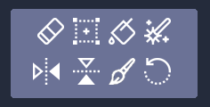
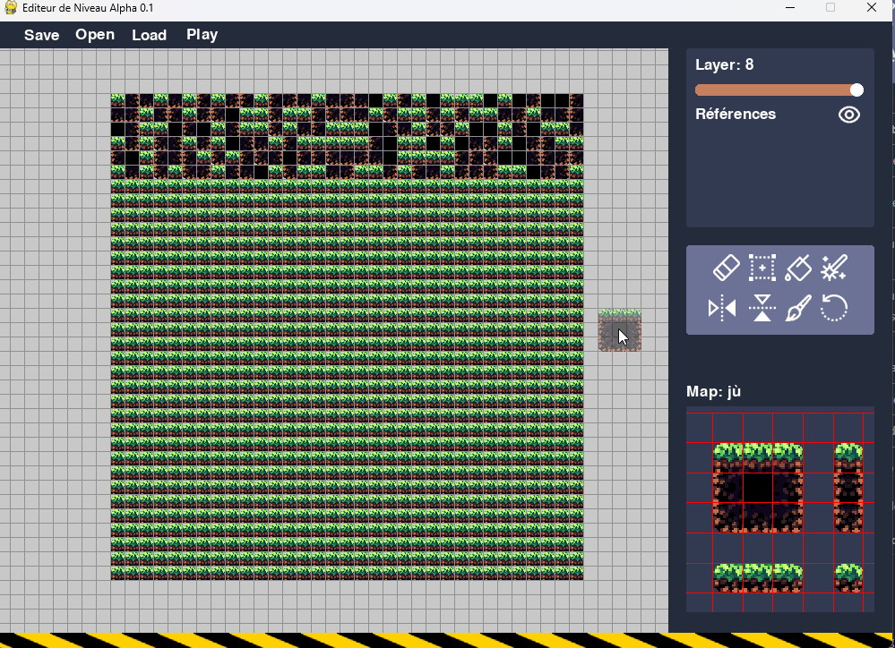
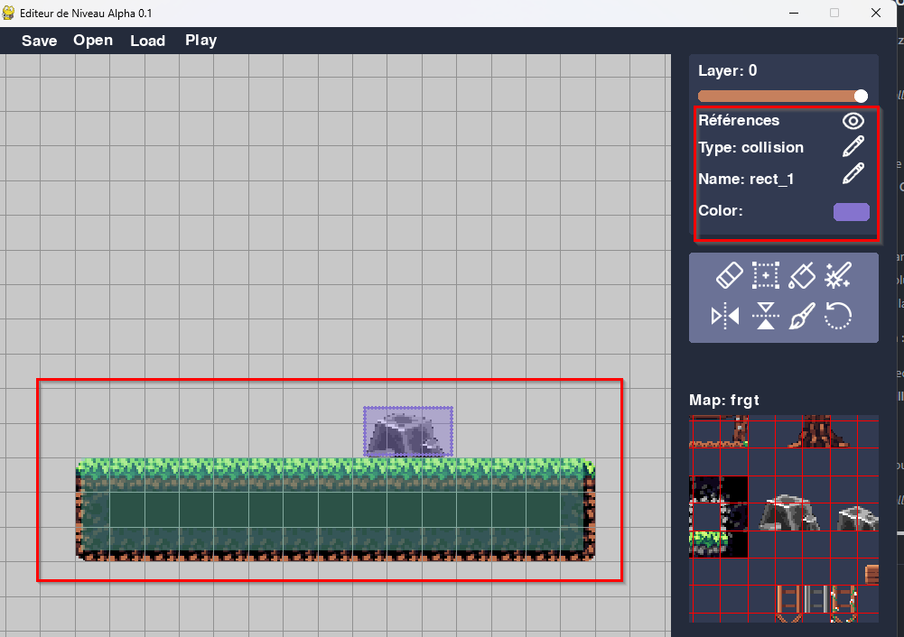

# 🎨 TileMapEditor
**TileMapEditor** est un éditeur de niveaux développé en Python avec Pygame, permettant de créer facilement des maps à base de tiles, avec gestion des layers, collisions et outils de dessin avancés. C'est avant tout un proof of concept, visant à démontrer une version fonctionnelle mais non optimisée du projet. Le code et le stockage doivent être améliorés pour une utilisation en production.

## ✨ Nouveautés
- 🔄 Undo/Redo : Annulez ou rétablissez facilement vos modifications avec ctrl + z et ctrl + y  
- 📏 Redimensionnement de la fenêtre : L'éditeur s'adapte désormais dynamiquement à la taille de la fenêtre

## 📌 Fonctionnalités  

### 🖌️ **Édition et outils de dessin**  
- Placement et suppression de tuiles sur **plusieurs couches (layers)**  
- 🔄 **Outils disponibles** :  
  - 🖌️ **Pinceau** : Placer des tuiles une par une  
  - 🧽 **Gomme** : Supprimer des tuiles  
  - 🎲 **Outil Random** : Placer des tuiles de manière aléatoire à partir d’une sélection  
  - 🪄 **Remplissage** : Remplit une zone de la grille avec une tuile sélectionnée  
  - 📐 **Sélection** : Placer ou modifier une zone de tuiles  
  - 🔄 **Rotation et symétrie** des tuiles  

### 🗺️ **Gestion des TileMaps**  
- 📂 **Chargement de tilesets** au format PNG, JPG, JPEG, BMP, GIF 
- 🔄 **Navigation dans la palette** de tuiles  
- 🔍 **Zoom et Pan** sur la palette pour choisir les tuiles  

### 🎭 **Gestion des calques (Layers)**  
- **Superposition de couches** pour organiser les éléments du niveau  
- 🔄 **Opacité ajustable** des calques  


### 🚧 **Collisions et objets**  
- 🚷 **Ajout de zones de collision**  
- 🎭 **Types de collision personnalisables** (ex: solides, zones interactives)  
- 🎯 **Sélection et modification** des collisions existantes  

### 💾 **Sauvegarde et Chargement**  
- 📁 **Exportation et importation** des niveaux en **JSON**  
- 📜 **Stockage des informations** : tuiles, layers, collisions  
- ↩️ **Fonctionnalité Undo/Redo** pour annuler ou rétablir des modifications


## 📂 Structure du projet
```
├── main.py  
├── Editor/
│   ├── DataManager.py  
│   ├── draw.py  
│   ├── saveLoader.py  
│   ├── tilemapOpener.py  
│   ├── TilePalette.py  
│   ├── ui.py  
│   ├── utils.py  
│   ├── viewport.py  
│   ├── History.py  
├── Assets/  
│   ├── tiles/  
│   ├── ui/  
│   │   ├── ui.json  
│   ├── icones/  
├── README.md  
```

### 🏁 Fichier Principal
**`main.py`**  
C'est le point d'entrée du programme.
Il initialise l'éditeur et gère la boucle principale du programme.
Charge l’interface, la gestion des événements et le rendu du viewport.

### 🗂️ Dossier Editor/
Ce dossier contient tous les fichiers liés à l'éditeur, incluant la gestion des données, l'affichage et les outils.

| Fichier                | Rôle |
|------------------------|------|
| **`DataManager.py`**   | Gère les données du niveau : **layers, tuiles, collisions et tilemaps** |
| **`draw.py`**         | Contient les **fonctions de rendu graphique** pour afficher le niveau, ses éléments et l'interface de l'éditeur |
| **`saveLoader.py`**    | Gère la **sauvegarde et le chargement** des niveaux au format JSON |
| **`tilemapOpener.py`** | Permet d'**ouvrir et charger** les fichiers de TileMaps (images de tiles) |
| **`TilePalette.py`**   | **Gère et stocke** les TileMaps disponibles, la navigation et la sélection des tuiles |
| **`ui.py`**           | Gère l’**interface utilisateur** (boutons, fenêtres, sliders) |
| **`utils.py`**        | Contient des **structures de données et enums** pour les outils, les tuiles, les collisions, les layers et tilemaps |
| **`viewport.py`**     | **Gère et stocke** l'affichage du niveau, la caméra, le zoom et la navigation |
| **`History.py`**      | Gère l'**historique des actions** avec **Undo/Redo** pour les modifications de tuiles et collisions |


### 🎨 **Dossier `Assets/`**  


| Dossier/Fichier  | Contenu |
|-----------------|---------|
| **`tiles/`**    | Contient les **tuiles** et tilesets utilisés dans l’éditeur |
| **`ui/`**       | Contient les éléments graphiques de l’interface utilisateur |
| **`ui.json`**   | Configuration de l'interface utilisateur |
| **`icones/`**   | Contient les **icônes** des outils et boutons |

## 🛠️ Dépendances  

Le projet utilise **Python 3** et **Pygame**. Installez les dépendances avec :  

```sh
pip install pygame
```

# 🚀 Utilisation de l'éditeur  

L'éditeur de niveau permet de **créer et modifier des maps** en plaçant des tuiles sur une grille, avec la prise en charge de **plusieurs TileMaps, layers, outils de dessin et gestion des collisions**. Pour le lancer il suffit d'executer le fichier ```main.py```

---

## 📌 1. Concepts clés  

### 🔳 **Le Viewport**  
Le **viewport** est la **zone principale** où l'on dessine et visualise le niveau. C'est ici que vous placez les tuiles, naviguez et interagissez avec la carte. Ici encadré en rouge, par défaut on ne voit pas le cadrillage car il faut déjà ouvrir une tilemap.




- **Naviguer dans le viewport** :  
  - 🖱️ **Clic droit + glisser** pour déplacer la vue  
  - 🔍 **Molette de la souris** pour zoomer  

- **Dessiner dans le viewport** :  
  - 🖱️ **Clic gauche + glisser** pour placer plusieurs tuiles  
  - 🖱️ **Clic gauche simple** pour poser une tuile  
- **Faire une sélection dans le viewport**
  - 🖱️ **Shift + Clic gauche** pour sélectionner une zone
  - 🖱️ **Naviguer ou zoomer** pour annuler la sélection
---

### 🎨 **La Tile Palette**  
La **Tile Palette** est l'interface où vous sélectionnez les tuiles que vous souhaitez utiliser.  




- **Naviguer dans la palette** :  
  - 🖱️ **Clic gauche + glisser** pour se déplacer  
  - 🎯 **Clic gauche** pour sélectionner une tuile  
  - 🎯 **Clic droit** pour sélectionner plusieurs tuiles  

- **Changer de TileMap** :  
  - ⬅️➡️ **Flèches gauche/droite** pour naviguer entre les TileMaps chargées  

---

### 🏗️ **Les TileMaps**  
Une **TileMap** est une **image contenant des tuiles** utilisées pour construire le niveau. L’éditeur prend en charge **plusieurs TileMaps**, permettant d'utiliser différentes textures pour un même projet.  



- **Ajouter une TileMap** :  
  1. Cliquez sur **"Open"** et sélectionnez une image  
  2. Définissez la **taille d’une tuile** pour le découpage (la plupart sont en 16x16 pixels)  
  3. Donnez un **nom** à la TileMap (chaque tilemap à un nom indépendant si vous utilisez un nom déjà utilisé dans le projet la tilemap sera remplacée par la nouvelle)  
  4. (Facultatif) Si l’image n’a pas de fond transparent, cliquez sur **"Set ColorKey"** et sélectionnez une couleur de transparence en cliquant sur la couleur correspondante sur l'image 
  5. Cliquez sur **"Done"** pour ajouter la TileMap  

---

## 🎨 2. Dessiner sur la carte  

### 📚 **Gestion des Layers** 
Un layer (ou couche) est une superposition de tuiles dans le niveau. Au lieu de placer toutes les tuiles sur un seul plan, l’éditeur permet d’organiser le niveau en plusieurs couches indépendantes.
✅ Pourquoi utiliser plusieurs layers ?  
- Organisation claire : Séparer les éléments du décor, les objets interactifs et les détails.  
- Effets visuels avancés : Ajouter des éléments en premier plan ou en arrière-plan.    
- Facilité d’édition : Modifier une partie du niveau sans affecter le reste.    
- Gestion des collisions : Placer les collisions sur un layer spécifique pour mieux   les gérer.  

⚠️ Chaque layer est indépendant : lorsque vous dessinez ou utilisez la gomme, cela n'affecte que le layer actif. Les autres layers restent intacts, ce qui permet de modifier une partie du niveau sans toucher au reste.

👉 Exemple :  

- Layer 0 : Sol et murs  
- Layer 3 : Objets comme des tables ou des buissons
- Layer 6 : Effets visuels (ombres, lumières)
- Layer 8 : Éléments de premier plan qui passent devant le joueur

L’éditeur dispose de **9 layers (couches)**, numérotés de **0 à 8** :  
- **0** est le plus en dessous  
- **8** est le plus au-dessus  




- **Naviguer entre les layers** :  
  - 🔼🔽 **Flèches haut/bas**  
  - 🎛️ **Slider d’opacité** pour ajuster la visibilité  de chaque layer

---

### 🛠️ **Outils disponibles**  



| 🛠️ Outil       | 🎯 Fonction | Sélection |
|---------------|------------------------------------------------|--------------------------|
| **Gomme** 🧽   | Efface une tuile ou une sélection             | Possible    (sur Viewport)             |
| **Collision** 📐| Permet de créer des collisions               | Nécessaire          (sur Viewport)      |
| **Remplissage** 🪄 | Remplit une zone avec une tuile choisie      | Nécessaire        (sur Viewport)       |
| **Random** 🎲  | Remplit une zone avec des tuiles aléatoires   | Nécessaire   (sur TileMap et Viewport)            |
| **Flip** ↔️    | Retourne les tuiles horizontalement ou verticalement | Non                   |
| **Rotation** 🔄| Fait pivoter les tuiles sélectionnées         | Possible    (sur TileMap)             |
| **Pinceau** 🖌️| Dessine des tuiles               | Possible (sur TileMap)                      |


 

- **Sélection de plusieurs tuiles** :  
  - Maintenez **Shift + Clic gauche** dans le viewport  
  - Dans la **Tile Palette**, utilisez **Clic droit**  

- **Annuler une sélection** :  
  - Naviguez ou **zoomez** pour la réinitialiser  

---

## 🚧 3. Gestion des Collisions  

L'éditeur permet d’ajouter **des zones de collision**, représentées par des **rectangles semi-transparents**.  

   

- **Créer une collision** :  
  1. Sélectionnez une zone dans le viewport  
  2. Cliquez sur l'outil pour **"Créer une Collision"**  

- **Modifier une collision** :  
  - 📜 **Nom** : Un identifiant unique (ex: "porte_1")  
  - 🏷️ **Type** : Regroupe plusieurs collisions (ex: "mur", "trigger")  
  - 🎨 **Couleur** : Change la couleur d'affichage  

- **Sélectionner une collision** :  
  - 🖱️ **Clic droit** sur un rectangle  
  - 🔄 Un contour **pointillé** s'affiche lorsqu’il est sélectionné  

- **Supprimer une collision** :  
  - Sélectionnez-la et appuyez sur **"Suppr"**  
 
- **Cacher les collisions** :
  - Cliquez sur l'oeil à côté de "références"  

---

## 💾 4. Sauvegarde et Chargement  


- **Sauvegarder un niveau** :  
  - Cliquez sur **"Save"** et enregistrez au format **JSON**  

- **Charger un niveau existant** :  
  - Cliquez sur **"Load"** et ouvrez un fichier **JSON**  

### 🔴 **Attention** :  
- Les **TileMaps sont enregistrées avec un chemin absolu**, ce qui peut poser problème si vous ouvrez le fichier sur un autre ordinateur.  
- Il faudra modifier **manuellement** 💀 le fichier JSON pour corriger les chemins (en général à la fin du fichier).  

## 🗂️ Structure des Données Sauvegardées

Les données du niveau sont stockées sous forme de fichier JSON, comprenant les éléments suivants :  

1. Layers (Couches)  
Chaque couche contient :  
- Opacity (Opacité) : La transparence de la couche (de 0 à 1).  
- Tiles (Tuiles) : Liste des tuiles placées sur la couche, chacune avec :  
    - TileMap : Le nom de la TileMap utilisée.  
    - x, y : Position de la tuile sur la grille.  
    - Originalx, Originaly : Position d'origine dans la TileMap.  
    - Rotation : Rotation de la tuile.  
    - FlipHorizontal, FlipVertical : Indicateur de retournement de la tuile. 

Exemple :  

```json
"layers": [
    {
        "opacity": 1.0,
        "tiles": [
            {
                "TileMap": "frgt",
                "x": 18,
                "y": 24,
                "Originalx": 12,
                "Originaly": 8,
                "rotation": 0,
                "flipHorizontal": false,
                "flipVertical": false
            }
        ]
    }
]
```
2. CollisionRects (Rectangles de collision)  
Liste des zones de collision, avec :  
- Type : Type de la collision (par exemple "collision").
- Name : Nom unique pour la collision.
- Rect : Position et taille du rectangle de collision sous forme de [x, y, largeur, hauteur].
- Color : Couleur de la collision, en format RGB.
Exemple : 
```json
"collisionRects": [
    {
        "type": "collision",
        "name": "rect_0",
        "rect": [131, 416, 232, 43],
        "color": [113, 208, 180]
    }
]
```
3. CurrentLayer (Couche active)
Indique le numéro de la couche actuellement sélectionnée dans l'éditeur.

4. CurrentTool (Outil actif)
L'outil actuellement sélectionné dans l'éditeur, par exemple "Draw", "Rubber"...

5. Viewport (Affichage)
Les paramètres de la vue dans l'éditeur :

- PanningOffset : Décalage de la caméra pour le déplacement.
- Zoom : Niveau de zoom de la vue.
6. TilePalette (Palette de Tuiles)
Contient la liste des TileMaps disponibles et l'index de la TileMap actuellement sélectionnée :  
    - CurrentTileMapIndex : Index de la TileMap active dans la palette.
    - TileMaps : Liste des TileMaps, chaque TileMap ayant :
    - Name : Nom de la TileMap.
    - Filepath : Chemin du fichier de l'image de la TileMap.
    - TileSize : Taille d'une tuile.
    - ColorKey : (Optionnel) Couleur de transparence de l'image.
    - Zoom : Niveau de zoom appliqué à la TileMap.
    - PanningOffset : Décalage pour l'affichage de la TileMap.   

(certains de ses paramètres sont propre à l'éditeur de niveau comme le panningOffset ou le zoom)

Exemple :

```json
"tilePalette": {
    "currentTileMapIndex": 0,
    "tileMaps": [
        {
            "name": "MaTileMap",
            "filepath": "C:/Users/Assets/tiles/Pixel_Woods_Tileset.png",
            "tileSize": 16,
            "colorKey": null,
            "zoom": 1.0,
            "panningOffset": [0, 0]
        }
    ]
}
```

## 🕹️ Intégrer un Niveau dans un Jeu Pygame  
Pour intégrer un niveau créé avec l'éditeur dans un jeu développé avec Pygame, il est nécessaire de répartir le code dans des fichiers et d'utiliser la Programation Orientée objet (POO), voici les étapes générales à suivre :

1. **Découper l'Image de la TileMap**
Une TileMap est une image composée de tuiles de même taille. Lorsque vous ajoutez une TileMap dans l'éditeur, celle-ci est découpée en tuiles selon la taille définie (par exemple 16x16 pixels par tuile).

Pour intégrer cette TileMap dans Pygame :

- Chargez l'image de la TileMap avec pygame.image.load().  
- Divisez l'image en tuiles en utilisant les dimensions définies pour chaque tuile.  
Vous pouvez créer une classe TileMap qui contient cette image découpée et qui gère l'affichage des tuiles sur le jeu, tout en les affichant à la position correspondante sur le terrain.  
2. **Utiliser les Données du Niveau**
- Les informations sauvegardées dans le fichier JSON peuvent être utilisées pour déterminer où placer chaque tuile sur le niveau, quelles TileMaps utiliser, et pour gérer les collisions.  

- Lors de l'initialisation du niveau, lisez le fichier JSON et récupérez les données des couches et des collisions.  
- Chaque couche contient une liste de tuiles. Parcourez cette liste et dessinez les tuiles dans la fenêtre du jeu à l'emplacement correct.  
Utilisez les informations sur les collisions pour créer des objets ou des surfaces dans Pygame qui représentent les zones de collision, comme des rectangles.  
3. **Gérer les Collisions**  
- Les rectangles de collision sont définis dans le fichier JSON. Vous pouvez les dessiner dans votre jeu pour aider à la mise au point. Utilisez la méthode pygame.Rect pour créer des objets rectangulaires correspondant aux données de collision, et vérifiez les collisions avec les personnages ou objets du jeu.  

- Affichage des collisions : Pour aider au débogage, vous pouvez afficher ces rectangles dans le jeu, en utilisant une couleur différente ou des bordures pour mieux visualiser où se situent les collisions.
Détection de collision : Utilisez les méthodes ```colliderect()``` ou ```collidelist()``` de Pygame pour vérifier les collisions entre les objets du jeu et les rectangles de collision définis.  
4. **Gérer la Caméra**  

- Utilisez un système de décalage pour simuler le mouvement de la caméra. Vous devez décaler l’affichage du niveau et des objets à l'écran en fonction de la position du joueur.  

## 🔮 Fonctionnalités à venir
-	🟢 Ajout de Points de Repère (Locations Points)
________________________________________
## 💡 Notes et retours
L’éditeur est encore en alpha. Si vous trouvez des bugs ou avez des suggestions, faites-moi signe ! 🚀
