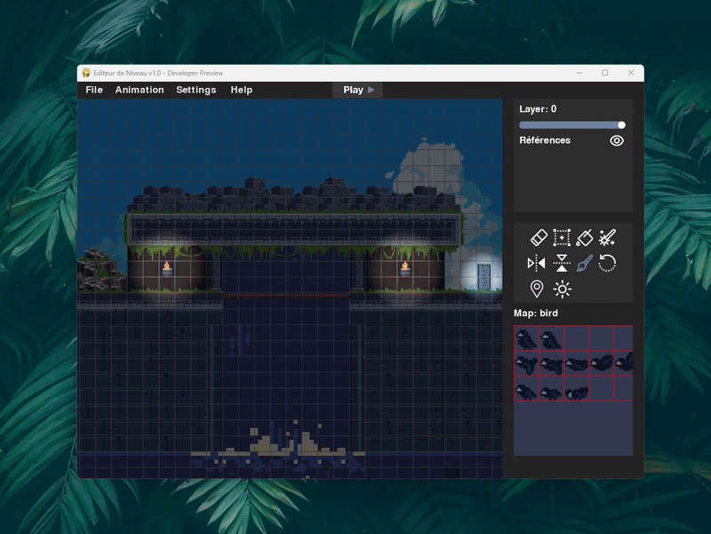

# 🎨 TileMapEditor



**TileMapEditor** est un éditeur de niveaux 2D multiplateforme conçu pour les jeux vidéo créés avec **Python** et **Pygame**. Il vous permet de créer, animer, tester et exporter des niveaux complexes à l’aide d’une interface intuitive, d’un éditeur nodal visuel, d’un système d’animation, et bien plus encore.

---

## 🧭 À propos

- ✅ **Cross-platform** : fonctionne sous **Windows**, **macOS** et **Linux**
- 🐍 Requiert **Python 3.10+** (support des `match`, `f-strings` et autres fonctionnalités modernes)
- ⚙️ Basé sur **Pygame-CE** *(Community Edition recommandé)* pour de meilleures performances (+20% FPS) mais utilisable avec pygame

> 📘 Une documentation complète est disponible ici :  
> 👉 [Accéder à la documentation](https://zerosh0.github.io/TileMapEditor/index.html)

---

## ✨ Fonctionnalités principales

| Fonctionnalité                          | Description |
|----------------------------------------|-------------|
| 🧱 Éditeur de tilemaps                 | Interface visuelle multi-calques pour dessiner vos niveaux |
| 🎞️ Animations intégrées               | Timeline, keyframes, preview en temps réel |
| ✨ Émetteurs de particules (VFX)       | Moteur de particules paramétrable avec forces, collisions et presets |
| 🧠 Éditeur nodal de gameplay           | Plus de 80 nœuds pour créer de la logique interactive |
| 🕹️ Mode Play                         | Test de niveau avec collisions, sauts, gravité, etc. |
| 🎯 Outils de dessin                    | Remplissage, pinceau, random, collisions, marqueurs |
| 🔊 Audio spatialisé                    | Prise en charge native des effets sonores avec position |
| 💡 Lumières dynamiques                | Support d’un éclairage paramétrable  |
| 💾 Sauvegarde/export JSON             | Export facile à intégrer dans un moteur Pygame |
| ⏪ Historique complet                  | Undo/Redo via `Ctrl+Z` / `Ctrl+Y` |
| ⚙️ Paramètres personnalisés           | Profil joueur, parallaxe, affichages, mode debug |

---

## 🚀 Installation rapide

```bash
# 1. Cloner le projet
git clone https://github.com/zerosh0/TileMapEditor.git
cd TileMapEditor

# 2. Créer un environnement virtuel (fortement recommandé)
python -m venv env
source env/bin/activate      # macOS/Linux
env\Scripts\activate         # Windows

# 3. Installer les dépendances
pip install pygame-ce        # ou `pip install pygame` si vous préférez

# 4. Lancer l’éditeur
python main.py
```

💡 **Vérifiez que vous utilisez Python 3.10 ou supérieur**  
pour assurer la compatibilité avec toutes les fonctionnalités modernes (`match`, `f-strings`, etc.)

---

## 🗂️ Structure du projet

```bash
TileMapEditor/
├── main.py                         # Lancement de l’éditeur
├── editor/
│   ├── ui/                        # UI personnalisée (sliders, boutons, dialogues)
│   ├── core/                      # Données, settings, historique, événements
│   ├── blueprint_editor/          # Éditeur nodal
│   ├── animations/                # Timeline, keyframes, animation preview
│   ├── vfx/                       # Moteur de particules (Playground, forces, presets)
│   ├── render/                    # Affichage, layers, parallax, zoom
│   ├── services/                  # Chargement/sauvegarde/export des fichiers
├── Assets/                        # Tuiles, images, icônes, backgrounds
├── docs/                # Site de documentation complet (HTML)
├── README.md
```

---

## ✨ Système de Particules VFX

Un moteur d'effets visuels complet et entièrement paramétrable :

- **Éditeur Dédié (Playground)** : Clic droit sur un émetteur pour le configurer dans une interface interactive.
- **Rendu Personnalisable** : Choix des styles de particules (Cercle, Étincelle, Bulle animée, Flocon de neige, Boule de feu, Étoile).
- **Forces Physiques Modulaires** : Application et réglage de forces comme la Gravité, le Vent, le Vortex, le Chaos et la Friction.
- **Collisions & Débris** : Les particules peuvent rebondir sur les collisions du niveau et sur le joueur, en générant des étincelles.
- **Galerie de Presets** : Choix parmi des configurations prêtes à l'emploi (Fire, Snow, Spark, Bubble, Portal, Fireball, Cosmic Starfield) avec aperçu animé.

---

## 🎮 Mode Play intégré

Prototypez vos niveaux directement dans l’éditeur, sans coder une seule ligne :

- ✔️ Collisions, gravité, sauts, déplacements  
- 🔁 Boucle de gameplay instantanée  
- 🧪 Mode "Fly" pour debug  
- 🧍 Point de spawn personnalisable  
- ⚙️ Profil joueur configurable (vitesse, gravité, canFly)  

---

## 🎞️ Système d’animations

Un éditeur d’animation complet directement intégré :

- 🎬 Timeline multi-couches  
- ⏱️ Keyframes visuelles (pose/suppression de tuiles)  
- 🔵 Mode "Record" pour keyframes automatiques  
- 🔁 Boucle, preview, overlay jaune sur les tuiles animées  
- 🔗 Contrôlable via le système nodal (`Play Animation`, `Pause`, `Set Time`)  

---

## 🧠 Éditeur Nodal de gameplay

Créez des logiques interactives sans coder :

- 🔴 Événements : `OnStart`, `OnEnter`, `OnExit`, `OnTick`, `OnOverlap`  
- ⚪ Actions : `Play Animation`, `Teleport`, `Emit Sound`  
- ✨ Particules (VFX) : `Set Emitter Active`, `Set Emitter Rate`, `Trigger Emitter Burst`  
- 🔧 Setters/Getters : `Set Speed`, `Get Health`, `Set Variable`  
- 🔁 Logique : `If`, `For`, `Sequence`, `Once`, `FlipFlop`  
- 💥 Debug intégré, gestion d’erreurs en temps réel  
- 🧩 Custom Nodes extensibles en Python (`@register_node`)  

📚 Tous les nœuds sont listés ici :  
👉 [Bibliothèque des nœuds](https://zerosh0.github.io/TileMapEditor/Documentation/pages/references.html)

---

## 💾 Formats & Fichiers

| Type de fichier      | Description                                      |
|----------------------|-------------------------------------------------|
| `.json`              | Niveau complet (layers, collisions, paramètres) |
| `.lvg`               | Graphe nodal associé (logiciel de gameplay)     |
| `backgrounds.json`   | Paramétrage des fonds parallaxe                  |
| `settings_ui`        | Paramètres utilisateur (FPS, affichages, projet de démarrage) |

📁 Les fichiers sont lisibles et modifiables à la main si besoin.

---


## 💡 Statut du projet

🎉 **Version actuelle : 1.3**  
Base des fonctionnalités stabilisée avec système VFX, éditeur nodal amélioré et régulation de performances.

📢 Contributions, idées, bugs et feedbacks sont les bienvenus !
